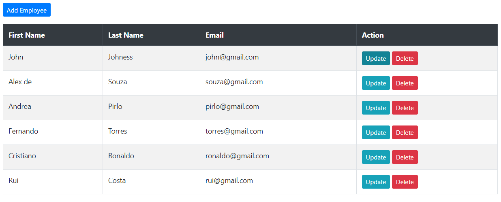
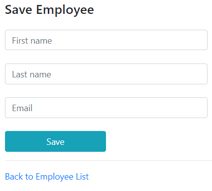
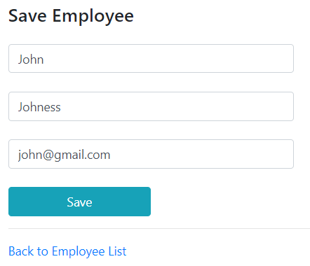
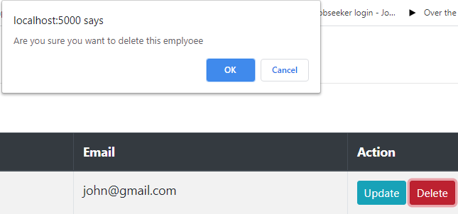
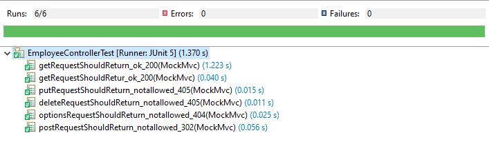

# User Directory 

## Spring Boot + JPA + MySQL + Thymeleaf (Template Engine) + JUnit5
 
The project is about inserting, deleting, updating and selecting users from the directory. 
This project is made with using Spring Boot, Data JPA, Thymeleaf (Template Engine). 
Testing was implemented with JUnit5. 

### Interface of User Directory

 
### Inserting and Updating User
  
 

When the user wants to update the person who exists on the list will be placed in the box after clicking on the update button. 
 

### Deleting User

When the user clicks on the update button, the pop-up window will have appeared on the top and the user will be asked whether sure to delete the person on the list.

## Testing 

In this project, Testingwas implemented for @Service Layer and @Controller.

@Controller :

Totally, 6 methods were constituted for @Controller. Those methods are about the testing the @Get, @Delete, @Post and @Put annotations to check whether returning HTTP: 200 or HTTP: 404 errors etc.

Passed : 6     Failed : 0

 

@Service :

Totaly, 3 methods were constituted for @Service. Those methods were about to check by id, creating person and getting all person whether returning correctly or not.

Passed : 3     Failed : 0

 

This project was done by Fuat Kara (BalamiRR).

# ~THE END ~
